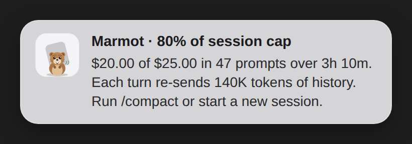

<p align="center">
  
</p>

<p align="center"><strong>A local Claude Code usage tool that tells you what is wasting tokens—and what to do next.</strong></p>

<p align="center">
  <a href="https://github.com/DrDroidLab/marmot"></a>
  <a href="https://github.com/DrDroidLab/marmot/blob/main/LICENSE"></a>
  <a href="https://discord.gg/AQ3tusPtZn"></a>
</p>

Marmot reads Claude Code's local session records, shows where the tokens went,
and nudges you while changing course can still save the next turn.

## Install

Requires Node.js 18 or newer.

```bash
npm install -g github:DrDroidLab/marmot
marmot init --hooks
```

Restart Claude Code, then verify it:

```bash
marmot doctor
```

Want to look first? `marmot --demo` uses synthetic data and reads none of your
sessions.

## What a nudge looks like

<p align="center">
  
</p>

The desktop notification stays short. Claude Code gets the evidence and the
next action in its transcript. Marmot speaks once per rule instead of repeating
the same warning after every turn.

## See where the tokens went

```bash
marmot
```

```text
  Marmot · your last 30 days
  40 sessions · everything below was read from ~/.claude/projects on this machine

  Spend              $4,184     modelled at published rates
  Prompts you typed  926        per session: 23.1 mean · 16 median · 79 p99
  Tokens             5.8B       input, output and cache
  Cache hit rate     98%        higher is cheaper
  Tool calls         13,768     3% failed
  Baseline context   35.3K      median, before you type

  Daily              ▃▂▄▁▃█▆▃▂▁▄▁▂▆▁▅▄▅  peak $671 · median $233

  Where it went
  claude-opus-5      $4,092     98% · 5.7B tokens
  claude-sonnet-5    $92        2% · 104M tokens

  Tools failing
  Bash                        126 of  4,933    3%
  mcp__supabase__execute_sql    3 of      3  100%

  Skills
  dataviz            6×         ~4.1K tokens to load

  MCP servers
  github            142×  26 tools · ~4.0K tokens
  sentry              0×  14 tools · ~2.3K tokens  ▲ never called
                    18,825 tokens on every request, 16,262 of them idle
```

The report gives every figure a window and a source. Run `marmot browse` when
you want to open a session and follow a number down to the turn that caused it.
The browser is one local HTML file with no network calls; `browse --no-text`
leaves prompts and replies out.

## Commands

```bash
marmot                    # report for the last 30 days
marmot --days 7           # choose a window
marmot browse             # open the local session browser
marmot nudges             # show only actionable findings
marmot sessions           # list sessions one per line
marmot mcp-audit          # measure MCP tool-definition weight
marmot config             # open your thresholds
marmot remind             # show or change when nudges fire
marmot doctor             # check readers, hooks and notifications
marmot test-notification  # send a test nudge
```

Useful options:

```bash
marmot --sessions         # include every session in the report
marmot --json             # machine-readable output
marmot --no-audit         # do not start MCP servers for measurement
marmot --no-refresh       # do not refresh plan-limit data
marmot browse --no-text   # exclude prompts and replies from the page
```

Run `marmot --help` for the complete reference.

## What Marmot catches

| Signal | What it means |
|---|---|
| Long session | Old turns keep travelling into new ones |
| Stale session | Work resumes days later in a different area |
| Idle MCP server | Tool definitions are loaded but never used |
| Premium model on light work | A costly model handles a small task |
| Low cache hit rate | Context is rebuilt instead of reused |
| Tool failures | Calls fail and then need another turn to recover |
| Usage spike | Today is far beyond your own normal |
| Limit pace | Your allowance is disappearing faster than its window |

Every check is deterministic. No model decides whether to nudge you.

Most of those are **causes rather than alarms**. What interrupts you is a
threshold—half, three quarters, then nine tenths of a plan window—and the nudge
carries whichever cause best explains getting there:

```text
▲ 75% of your weekly limit
  76% of your weekly limit is gone on Max 20×. It resets in 2.1d.
  Each turn re-sends 603K tokens of history, over 57 prompts and 3.8d.
  Run /compact, or start a new session for the next distinct piece of work.
```

Causes are ranked by how much each explains, how confident Marmot is, and how
cheaply it can be fixed. `marmot` prints that ranking under **Why it is going**,
scores included. When nothing scores highly enough, the threshold still fires
without an invented reason.

## When Marmot speaks

Rules in the `live` list can interrupt at the end of a turn—the moment you can
still change the session in front of you. Everything else waits for the daily
digest.

A rule speaks once per session. Cost warnings can return when the cost doubles,
and plan warnings return at the configured marks. One live nudge also buys 20
minutes of quiet before another can interrupt; held findings remain in the
report and digest.

## Dollars or allowance

On a subscription, the dollar figure is labelled **Modelled spend**. It is what
the tokens would cost at published API rates, not what you pay. Marmot also
shows the plan limits Claude Code exposes locally:

```text
  Modelled spend        $1,825    at API rates — not what you pay on Max 20×
  5-hour session limit  5%        resets in 1.2h
  Weekly limit          19%       resets in 3.0d
  Usage credits         $0.00 of $50.00   real money, beyond the plan
```

On pay-as-you-go usage, the same dollar figure is labelled **Spend** because it
is the bill. Marmot uses percentage limits when the plan reports them and dollar
caps when it does not.

## Configuration

The defaults are deliberately quiet, so configuration is optional. If a rule
fires on most of your sessions, it is describing how you work rather than
flagging something unusual—raise the threshold instead of learning to ignore it.

```bash
marmot config set session.costCap=50           # change one threshold
marmot config set 'limits.steps=[25,50,75]'    # values are JSON
marmot config set notify.bell=false mcp.autoAudit=false
```

Marmot prints what changed, creates the file from the defaults when needed, and
leaves every other setting alone:

```text
  /Users/you/.claude/marmot.json
    session.costCap: 25 → 50
```

This is the form to use from a script or coding agent. To edit or inspect the
whole file:

```bash
marmot config          # open it in your editor
marmot config --print  # print it in the terminal
```

Nothing needs restarting—the next run reads it. Marmot uses `$VISUAL`, then
`$EDITOR`, then the platform default. A terminal editor is used only when there
is a terminal to attach it to.

### Reminders

```bash
marmot remind                      # show what fires and when
marmot remind --at 50,75,90        # set quota marks
marmot remind --cap 100            # set a dollar ceiling
marmot remind --off                # turn reminders off
```

Marmot chooses the useful ceiling from the plan it can read:

| Plan | Ceiling |
|---|---|
| **Pro, Max, most Team seats** | Reported quota, at 50%, 75% and 90% by default |
| **Enterprise or a plan reporting no quota** | Daily dollar cap; session cap is half |
| **Pay-as-you-go API** | Dollar cap, because the figure is the bill |

Only one live nudge interrupts at a time. After one fires, Marmot leaves 20
minutes of quiet before another (`interrupt.minGapMins`). Held findings remain
in `marmot` and the daily digest.

### What Claude Code says is eating your limits

Refreshing limits also captures Claude Code's own attribution of your usage:

```text
  What is driving your limits · last 7d
  Claude Code's own attribution, over 2,594 requests in 19 sessions.
     96%  of your usage was at >150k context
     80%  of your usage came from sessions active for 8+ hours
          top skills: claude-api 1%
          top mcp servers: sprinto 1%
```

This is not inferred from transcripts. `limit-drivers` quotes Claude Code's
attribution when a share passes `limits.driverMinPercent`—60% by default.

The source is human-formatted text with no stability guarantee. Every line is
optional; unrecognised lines are skipped, so a format change costs this section
rather than the whole report.

### Limit thresholds

`limit-reached` speaks at marks on the way to a limit, so you hear *half gone*
before *nearly out*. Each mark speaks once.

`limit-pace` compares the percentage used with the percentage of the window
that has passed. It warns only when the allowance is on course to run out before
it resets:

```text
  ▲ Spending your weekly allowance faster than it refills
    43% through the weekly window with 78% of it gone — 1.8× the pace that
    would last. At this rate it runs out in about 20.3h, 3.2d before it resets.
```

```jsonc
"limits": {
  "enabled": true,
  "steps": [50, 75, 90],
  "byPlan": {
    "Pro":        [50, 75, 90],
    "Max 5×":     [50, 75, 90],
    "Max 20×":    [50, 75, 90],
    "Team":       [50, 75, 90],
    "Enterprise": [50, 75, 90],
    "API":        []
  }
}
```

### The nudge thresholds

| Rule | Fires when | Default |
|---|---|---|
| `session-cost` | One session's modelled cost | > $25 |
| `daily-cost` | Today's total | > $50 |
| `daily-baseline` | Today against your trailing average | > 2.5σ over 14 days |
| `session-topics` | A long session resumed in a different area | > 1 day gap, ≥ 2 areas |
| `limit-reached` | A plan window crosses a configured mark | 50%, 75%, 90% |
| `limit-pace` | Allowance is disappearing faster than the window | > 1.5× pace, ≥ 15% elapsed, ≥ 20% used |
| `limit-drivers` | Claude Code attributes a large share to one behavior | > 60% |

Idle MCP servers, subagent burn, carried history, quiet premium-model work and
failing tools are now ranked as **causes** behind these thresholds. They explain
a nudge instead of creating a second, duplicated alarm.

### The keys people actually change

```jsonc
{
  // Rules allowed to interrupt at the end of a turn.
  "live": ["limit-reached", "session-cost", "daily-cost",
           "daily-baseline"],

  "interrupt": { "minGapMins": 20, "maxPerNudge": 1 },

  "notify": { "desktop": true, "bell": true, "app": null,
              "sound": "Ping", "persist": true },

  "digest": { "cadence": "daily" },

  "limits": { "enabled": true, "causeFloor": 0.08,
              "steps": [50, 75, 90],
              "autoRefresh": true, "paceRatio": 1.5,
              "paceMinElapsed": 15, "paceMinUsed": 20,
              "driverMinPercent": 60 },

  "browse": { "keep": 5 },
  "mcp": { "enabled": true, "autoAudit": true,
           "auditMaxAgeDays": 7 },

  "session": { "costCap": 25, "turnCap": 20, "costFloor": 1 },
  "daily": { "costCap": 50, "baselineSigma": 2.5,
             "baselineDays": 14 },

  // USD per million tokens for negotiated pricing.
  "rateOverrides": { "claude-opus-5": { "in": 5, "out": 25 } }
}
```

`marmot config` writes every key with its default; these are the ones most
people need.

Optional statusline:

```bash
marmot init --statusline
```

```text
$12.40 · 57 prompts · 41% ctx · 97% cache · Opus ▲
```

The statusline is separate because installing it replaces an existing Claude
Code statusline.

## Why you can trust the numbers

Claude Code writes one JSONL entry per response content block, and each entry
repeats the same usage object. Marmot counts usage once per API response;
summing every entry would inflate a tool-heavy session by roughly 1.9×.

Cache writes are also priced at their recorded lifetime: 1.25× input price for
five minutes and 2× for one hour. Treating every write as the cheaper kind can
understate a heavy session by about a fifth.

A turn means a prompt you typed. Tool results also appear as `user` entries in
Claude Code's records, but Marmot does not count them as human prompts. These
cases are pinned by the test suite.

## Good to know

- **Local by design.** Marmot has no account or hosted service.
- **The report avoids conversation text.** It reads counts, identifiers and
  tool names.
- **The browser includes prompts and replies.** Use `browse --no-text` to leave
  them out. The generated page stays local either way.
- **MCP audit starts configured servers.** Use `--no-audit` or set
  `mcp.autoAudit=false` if you do not want that.
- **Subscription dollars are estimates.** `Modelled spend` is the API-rate value,
  not your invoice; the plan-limit percentage is the useful ceiling.
- **Marmot is alpha.** Claude Code's session format is internal and can change.
  `marmot doctor` shows what remains readable.

## Notifications not appearing?

```bash
marmot test-notification
```

If the test does not appear, check Focus or Do Not Disturb first. Then run
`marmot doctor` to see which notification path Marmot is using.

Keep transcript nudges while disabling desktop notifications or sound:

```bash
marmot config set notify.desktop=false
marmot config set notify.bell=false
```

## Update or remove

```bash
npm install -g github:DrDroidLab/marmot  # update
marmot init --hooks --remove             # remove Marmot hooks
```

## Contributing

```bash
npm test
```

Please work on a branch and open a pull request. `main` moves through reviewed
pull requests only.

## License

[MIT](LICENSE)
