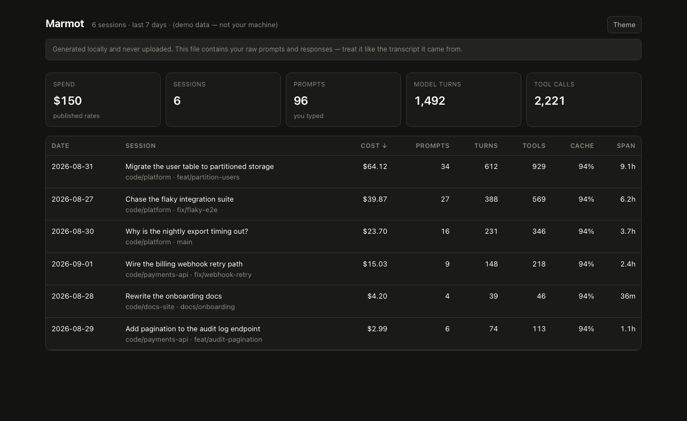
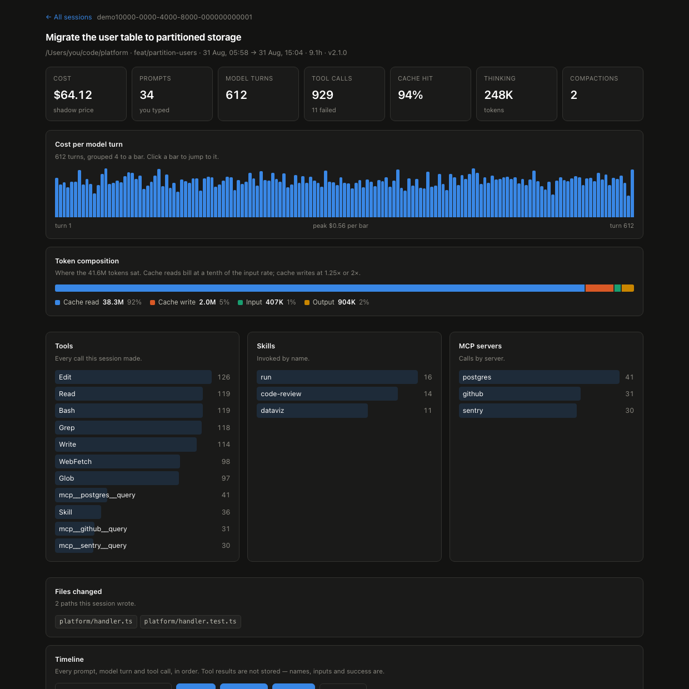

#  Marmot

[](https://github.com/DrDroidLab/marmot)
[](https://discord.gg/AQ3tusPtZn)

> **Alpha.** This is early software, and it reads a file format that is internal
> and undocumented — a Claude Code update can break a metric. `marmot doctor`
> shows what's still readable on your machine. Bugs and ideas are welcome, in
> [issues](https://github.com/DrDroidLab/marmot/issues) or on
> [Discord](https://discord.gg/AQ3tusPtZn).

**Spend fewer tokens on Claude Code — with nudges that arrive while you can still do something about it.**

Most of what you burn is not the work. It is context you are carrying and not
using, tool definitions loaded on every request and never called, a premium
model on a job that did not need one, a session that has been open for three
days. None of it announces itself, and by the time a number looks wrong the
tokens are gone.

Marmot reads the session records Claude Code already writes to your disk, finds
those patterns, and interrupts you at the point where stopping is still worth
something. Same tokens your plan limits are counted in.

```bash
npx @drdroidlab/marmot --demo      # see the nudges on synthetic data
npx @drdroidlab/marmot             # then on your own
```

Node 18+, zero dependencies, entirely local. Works on **all Claude plans**.

---

## What it catches

A real one, from the machine this was built on:

```
  ▲ MCP servers attached but never called
    sentry, github, kubernetes, datadog, linear, google-sheets — configured,
    and not invoked once in this window. Their tool definitions are ~16,262
    tokens, sent with every request — 43% of your 37.4K median session prefix.
    Detaching what you do not use is a straight saving on every request.
```

Nothing in Claude Code surfaces that, and it had been true for weeks. The rest
of what it looks for:

| Nudge | The waste it finds |
|---|---|
| `mcp-idle` | Tool definitions shipped on every request for servers you never call |
| `session-turns` | A long session re-sending every earlier turn into every later one |
| `session-topics` | A session resumed days later, still carrying context for work you finished |
| `premium-light-work` | A premium model on a job Sonnet would have done |
| `premium-window` | …and that becoming a habit rather than a one-off |
| `cache-hit` | Context being rebuilt each turn instead of continued — cache reads cost a tenth of fresh input |
| `tool-errors` | Failed calls, paid for twice: once to fail, once to retry |
| `limit-reached` | Half, three quarters, then nine tenths of your plan's 5-hour or weekly allowance gone |
| `daily-baseline` | A day well past your own normal, whatever normal is for you |
| `session-cost` / `daily-cost` | A session or day past a dollar ceiling — **pay-as-you-go only**, see below |

Every rule is deterministic and local. **No model decides whether to nudge
you**, and every threshold is yours to move.

## When it reaches you

Timing is the whole point, so you choose which rules speak when:

- **Mid-session**, at the end of a turn, for the rules in `live` — the only
  moment you can still change course. Once per rule, again at each doubling for
  cost, with a bell and a notification so it does not scroll past.
- **Once a day** for everything else. A nudge you cannot act on right now is an
  interruption, not a nudge.
- **In the statusline**, if you want it always in view.

## The evidence behind every nudge

A nudge you cannot trace produces suspicion rather than a change of habit, so
`marmot` prints the window every figure came from:

```
  Marmot · your last 30 days
  40 sessions · everything below was read from ~/.claude/projects on this machine

  Spend              $4,184     modelled at published rates
  Prompts you typed  926        per session: 23.1 mean · 16 median · 79 p99
  Tokens             5.8B       input, output and cache
  Cache hit rate     98%        higher is cheaper
  Tool calls         13,768     3% failed
  Baseline context   35.3K      median, before you type — prompt, skills, tool definitions

  Daily              ▃▂▄▁▃█▆▃▂▁▄▁▂▆▁▅▄▅  peak $671 · median $233

  Where it went
  claude-opus-5      $4,092     98% · 5.7B tokens
  claude-sonnet-5    $92        2% · 104M tokens

  Skills
  dataviz            6×         ~4.1K tokens to load

  MCP servers
  github            142×  26 tools · ~4.0K tokens
  sentry              0×  14 tools · ~2.3K tokens  ▲ never called
                    18,825 tokens on every request, 16,262 of them idle
```

### Dollars, or allowance

On a subscription the dollar figure is not what you pay — you already paid it,
and what you actually spend is *allowance*. So Marmot reads your plan and your
real limit utilisation from what Claude Code caches, and reports both:

```
  Marmot · your last 7 days
  23 sessions · Max 20× · everything below was read from ~/.claude/projects

  Modelled spend        $1,825    at API rates — not what you pay on Max 20×
  5-hour session limit  5%        resets in 1.2h
  Weekly limit          19%       resets in 3.0d
  Usage credits         $0.00 of $50.00   real money, beyond the plan
```

On pay-as-you-go the same figure is the real price, and it is labelled
**Spend** rather than *Modelled spend* — there the dollars are the point.

The percentages come from the snapshot Claude Code caches, so they are as fresh
as the last time it asked; anything over an hour old is shown with its age
attached rather than as current. Subscription plans return no dollar value for
a limit, which is exactly why percent is the unit.

**Baseline context** is what every request carries before you type — system
prompt, skill descriptions, every attached tool definition — and it is what
makes an idle server legible as a cost rather than a checkbox.

Spend is a **shadow price**: what these tokens would have cost at published API
rates, not an invoice line. Right for comparing your own sessions to each
other, wrong for finance.

---

## Install

**As a CLI**

```bash
npx @drdroidlab/marmot            # no install
npm i -g @drdroidlab/marmot       # or keep it
```

**As a Claude Code plugin** — this is the one that saves you tokens, because it
is the only way the mid-session nudges can reach you at all.

```
/plugin marketplace add DrDroidLab/marmot
/plugin install marmot@marmot
```

Then **restart Claude Code** — hooks and commands only load at session start. You get:

- **Live nudges** at the end of a turn, for the rules in `live` — the ones you
  can still act on. Once per session per rule, again at each doubling for cost,
  with a bell and a desktop notification so they do not scroll past.
- **A daily digest** on your first session each day: what yesterday cost, and
  what it flagged.
- `/marmot:usage` — everything, on demand.
- `/marmot:config` — move a threshold.

Check it loaded — the status line, not the component count:

```bash
claude plugin list | grep -A4 'marmot@'    # Status: ✔ enabled
```

**The statusline** — plugins can't ship one, so it's a separate opt-in.

```bash
npx @drdroidlab/marmot init --statusline
```

```
$12.40 · 57 prompts · 41% ctx · 97% cache · Opus ▲
```

The `▲` appears once you're past your own caps — the cheapest possible reminder,
always in view.

## Usage

| Command | Slash command | What it does |
|---|---|---|
| `marmot` | `/marmot:usage` | Nudges, plus the window they came from |
| `marmot config` | `/marmot:config` | Open the thresholds file |
| `marmot browse` | | Build the session browser page and open it |
| `marmot nudges` | | Just the nudges, nothing else |
| `marmot sessions` | | One line per session |
| `marmot mcp-audit` | | Measure what each MCP server's tool definitions cost |
| `marmot doctor` | | What's readable on this machine, and what isn't |
| `marmot init` | | Write the thresholds file |

`/marmot:usage` is the one to reach for. `marmot nudges` is the same findings
with the reporting stripped out, which is what you want in a script or a
pre-commit hook.

| Flag | |
|---|---|
| `--days N` | Window, default 30 |
| `--sessions` | Add the per-session list to the report |
| `--browse` | Also build and open the session browser page |
| `--demo` | Synthetic data, safe for screenshots |
| `--json` | Machine-readable |
| `--root DIR` | Claude Code home, default `~/.claude` |
| `--session ID` | `browse`: just this one |
| `--limit N` | `browse`: most recent N, default 25 |
| `--no-text` | `browse`: counts and tool names only, no prompts |
| `--no-audit` | Skip measuring MCP servers this run |

### Chasing a nudge to its source

One self-contained HTML file, written locally and opened in your browser — no CDN, no network, no web fonts.

It opens on **the same figures as the report** — spend, tokens, cache, baseline context, the model split, skills, MCP servers and every nudge — because they are computed once in Node and shipped with the page rather than recalculated in the browser. From there each session opens onto its full timeline — every prompt, reply and tool call, with a cost-per-turn chart, the token split, a text filter and an errors-only toggle — which is how you find the turn where a session started getting expensive.





### Finding the cheapest saving you have

Idle MCP servers are usually the largest single win, because their cost is paid
on *every* request rather than once. Nothing on disk records how big those tool
definitions are, so Marmot asks the servers directly:

```bash
npx @drdroidlab/marmot mcp-audit
```

```
  Server                   Tools    Tokens    Calls (30d)
  github                      26     ~4.1K            142
  kubernetes                  28     ~5.2K             18
  sentry                      14     ~2.3K              0  ▲
  datadog                     22     ~3.6K              0  ▲

  15,200 tokens of tool definitions ride on every request.
  ~5,900 of them (39%) belong to 2 servers you have not called in 30 days:
  sentry, datadog
```

The report does this for you when it has no recent figures, and caches the
result for a week. It is the only thing Marmot does that **starts your servers**
rather than reading a file — `mcp.autoAudit: false` or `--no-audit` keeps it
read-only. `--tools` breaks it down per tool.

## Configuration

The defaults are deliberately quiet, so this is optional — but it is the
difference between nudges you act on and nudges you mute. If a rule fires on
most of your sessions it is describing how you work rather than flagging
anything, and it should be raised, not ignored.

```bash
marmot config          # opens ~/.claude/marmot.json, creating it if you have none
marmot config --print  # ...and print it to the terminal
```

or `/marmot:config` inside Claude Code. Nothing needs restarting — the next run
reads it.

It opens in a real text editor rather than a preview — `$VISUAL`/`$EDITOR`, else
the platform default. A terminal editor like vim is used only where there is a
terminal to attach it to, so `/marmot:config` opens a window instead of hanging.

### Limit thresholds

`limit-reached` speaks at marks on the way to a limit rather than at one cap,
so you hear *half gone* long before *nearly out*. Each mark speaks once.

```jsonc
"limits": {
  "enabled": true,
  "steps": [50, 75, 90],        // the default marks
  "byPlan": {                   // the same percentage is a different amount of room
    "Pro":        [50, 75, 90],
    "Max 5×":     [50, 75, 90],
    "Max 20×":    [50, 75, 90],
    "Team":       [50, 75, 90],
    "Enterprise": [50, 75, 90],
    "API":        []            // nothing to run out of
  }
}
```

### The nudge thresholds

| Rule | Fires when | Default |
|---|---|---|
| `session-turns` | Prompts you typed in one session, **and it never compacted** | > 20 |
| `session-cost` | One session's modelled cost | > $25 |
| `daily-cost` | Today's total | > $50 |
| `daily-baseline` | Today against **your own** trailing average | > 2.5σ over 14 days |
| `premium-light-work` | Premium-model share on a session that stayed small | > 70% and < 10 tool calls, or docs/tests only |
| `cache-hit` | Input tokens served from cache | < 70% over ≥ 20 turns |
| `tool-errors` | Failed tool calls | > 10% over ≥ 20 calls |
| `mcp-idle` | Servers configured and never invoked | any |
| `session-topics` | A long session resumed after a gap, in a different area | > 1 day gap, ≥ 2 areas |
| `premium-window` | A habit of premium models on small sessions | ≥ 5 sessions |

If a rule fires on nearly every session, **raise its cap rather than removing
it**. Every rule carries three guards — a ratio gap, a minimum sample and a
dollar floor — because a nudge that always fires gets muted, and then none of
them work.

### The keys people actually change

```jsonc
{
  // Which rules may interrupt you mid-session. Everything else waits
  // for the daily digest.
  "live": ["session-cost", "daily-cost", "daily-baseline",
           "session-turns", "limit-reached"],

  // How a nudge reaches you, beyond the line in the transcript.
  // "app" overrides which macOS app posts the notification — see below.
  "notify": { "desktop": true, "bell": true, "app": null, "sound": "Ping" },

  // "off" stops the daily digest entirely.
  "digest": { "cadence": "daily" },

  // Marks on the way to your plan's limits. Each speaks once. See below.
  "limits": { "enabled": true, "steps": [50, 75, 90] },

  // The report measures your MCP servers when it has nothing recent.
  // autoAudit false means it only ever measures when you ask it to.
  "mcp": { "enabled": true, "autoAudit": true, "auditMaxAgeDays": 7 },

  "session": { "costCap": 25, "turnCap": 20, "costFloor": 1 },
  "daily":   { "costCap": 50, "baselineSigma": 2.5, "baselineDays": 14 },

  // Set these if you are on negotiated rates and want the modelled
  // cost to match your contract. USD per million tokens.
  "rateOverrides": { "claude-opus-5": { "in": 5, "out": 25 } }
}
```

`marmot config` writes every key with its default — these are the ones worth
knowing about.

**The dollar caps do not fire on a subscription at all.** `session.costCap` and
`daily.costCap` are absolute figures in modelled dollars, and on a plan you pay
a flat fee for, "$511 today against a $50 cap" is not overspending — it is a
Tuesday. A rule that says otherwise every day gets muted along with the ones
worth reading, so Marmot skips them once it detects a subscription and leans on
`limit-reached` and `daily-baseline` instead. On pay-as-you-go they fire
normally, because there the figure really is the bill. A plan it cannot detect
is treated as billed, which is the safer way round.

**Turning the alerts down.** `notify.bell` rings the terminal bell,
`notify.desktop` raises a system notification. Set either to `false`.
`MARMOT_NO_NOTIFY=1` silences both for one run, and CI is silent automatically.

**How a notification gets to you.** Your terminal posts it itself where it can,
via an OSC escape sequence — iTerm2, Ghostty, WezTerm, kitty, Konsole, Windows
Terminal and Hyper all support this, with nothing to install or allow.
Otherwise the OS does: `osascript`, `notify-send` or PowerShell, all of which
ship with it. `marmot doctor` names the channel in force.

Terminals not known to support the sequence are never sent one, since an
unrecognised escape code can print as visible garbage. The marmot appears on
Linux and Windows; macOS shows the posting app's icon and gives us no say.

### If no notification arrives

**Check the quiet-hours setting first.** This is the usual answer, and it
suppresses notifications from every app at once, so nothing you change in
Marmot will help until it is off.

| | Where to look |
|---|---|
| **macOS** | Click the clock → is a **Focus** mode on? Or Control Centre → Focus. Do Not Disturb hides everything, including notifications from apps that are fully allowed. |
| **Windows 11** | Settings → System → **Notifications** → *Do not disturb* off. Check *Notifications* itself is on, and that focus sessions are not scheduled. |
| **Windows 10** | Settings → System → **Focus assist** → set to *Off*. |
| **GNOME** | Settings → **Notifications** → *Do Not Disturb* off. |
| **KDE Plasma** | System Settings → **Notifications** → *Do Not Disturb* off. |

**Then check the app is allowed.** On macOS, System Settings → Notifications →
the app `marmot doctor` names. If it is not in that list it cannot be granted —
macOS only lists apps that have registered themselves — so point Marmot at one
that is: `"notify": { "app": "com.googlecode.iterm2" }`, a bundle id or an app
name. On Windows, allow notifications from PowerShell. On Linux, `notify-send`
needs libnotify (`libnotify-bin` on Debian and Ubuntu).

Or set `notify.desktop` to `false` — the bell and the nudge in your transcript
are unaffected either way.

**About the bell.** `notify.bell` writes a terminal BEL to `/dev/tty`, and asks
the notification to play a sound. The sound is the reliable half: a hook's
output is a pipe Claude Code reads, not a terminal, so stderr would swallow the
BEL. `notify.sound` names it; *Ping* by default.

**Measuring MCP servers less often.** Raise `mcp.auditMaxAgeDays`, or set
`mcp.autoAudit` to `false` and run `marmot mcp-audit` when it suits you.

**Starting the nudges over.** `~/.claude/marmot-state.json` records what has
already been said. Delete it to hear everything again.

## Why you can trust the numbers

A nudge is only worth acting on if the figure behind it is right. The transcript
format is internal and undocumented, and two details in it are easy to read
wrong — both of which would have a rule firing on a session that was fine, or
staying quiet on one that was not:

- **Cache writes are priced at their actual TTL** — 2× at one hour, 1.25× at five minutes. Claude Code writes 1h entries, so pricing every write at 1.25× understates a heavy session by about a fifth.
- **Usage is counted once per API response.** Claude Code writes one JSONL entry per content block, and every one repeats the same `usage` object. Summing per entry inflates cost and turns by roughly **1.9× on a tool-heavy session**. Marmot dedupes by `message.id`.

And a "turn" means **a prompt you typed**. Tool results arrive as user entries too, so counting every user entry reads a 57-prompt session as 1,191.

## Privacy

Everything runs locally. Nothing is uploaded, and there is no service to upload it to — no account, no API key, no server.

The **report** reads only counts, identifiers and tool names, never your prompt or response text. To name your plan and its limits it reads `~/.claude.json`, taking the rate-limit tier and the cached utilisation percentages — never the email address, account ids or organisation name that sit beside them. The **browser page** does read them, because that is the point of it; `marmot browse --no-text` leaves the text out if you want to share it.

Tool *results* are never stored — around 95% of the bytes on disk, and dropping them is what turns a 41MB transcript into a 1MB page.

## License

MIT
