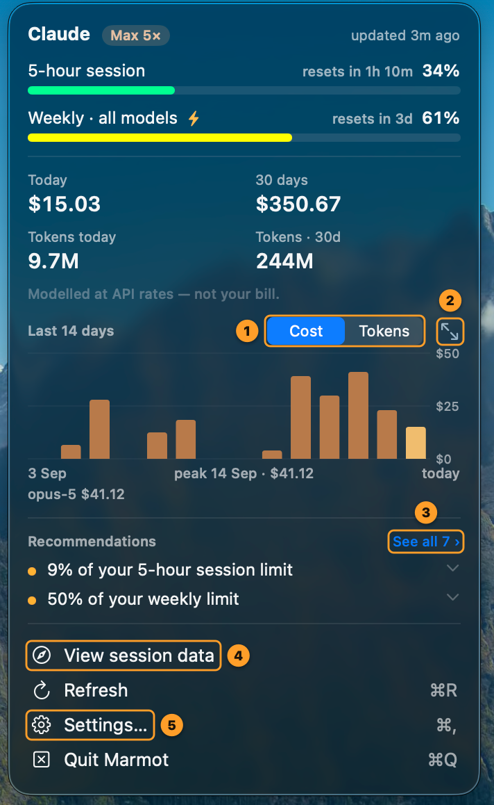
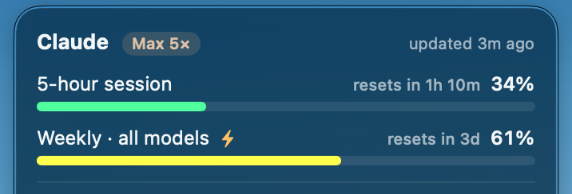
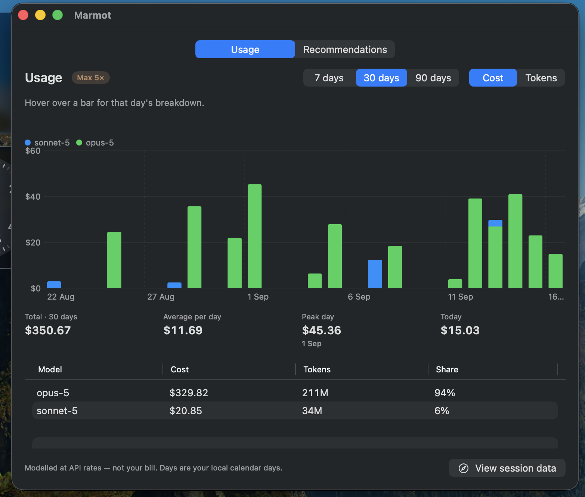
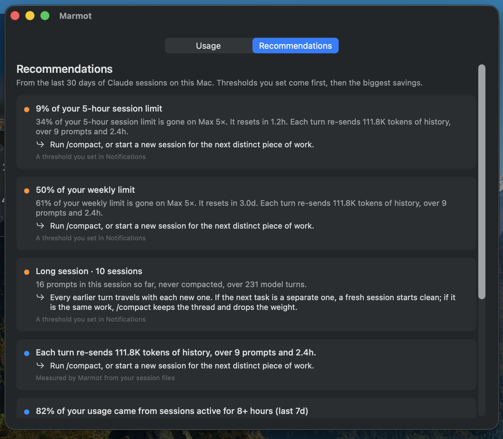
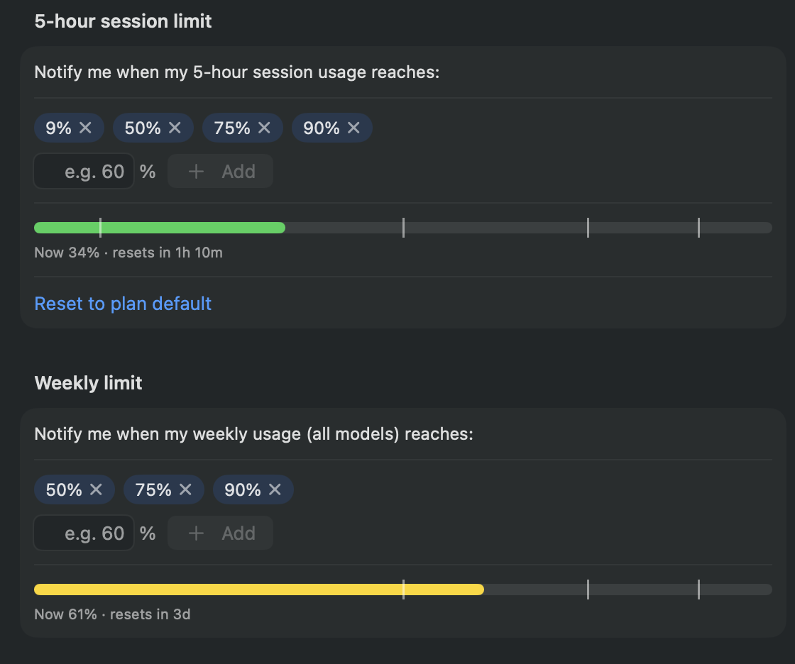
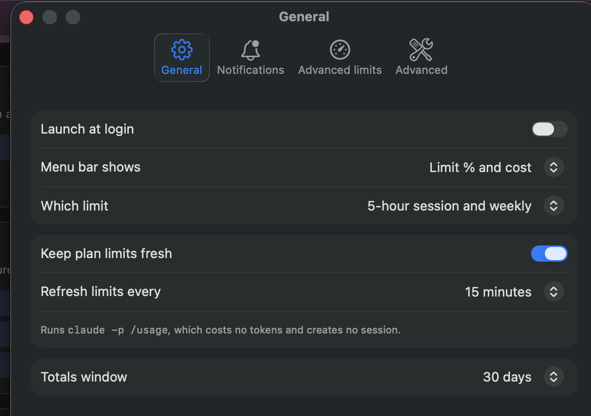
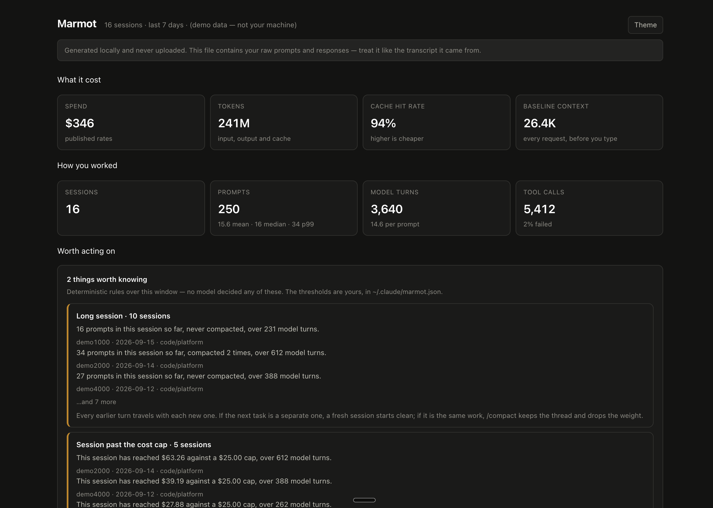

<p align="center">
  
</p>

<p align="center"><strong>A local Claude Code usage tool that tells you what is wasting tokens—and what to do next.</strong></p>

<p align="center">
  <a href="https://github.com/DrDroidLab/marmot"></a>
  <a href="https://github.com/DrDroidLab/marmot/blob/main/LICENSE"></a>
  <a href="https://discord.gg/AQ3tusPtZn"></a>
</p>

Marmot reads the session records Claude Code already keeps on your machine and
points out where tokens are being wasted: context that has outlived the task,
MCP tools that are loaded but never called, poor cache reuse, repeated tool
failures, or a costly model doing light work.

The useful part is timing. Marmot can nudge you at the end of a turn, while
starting fresh, compacting, or changing course can still save the next one.

<p align="center">
  
</p>

Click the marmot in your menu bar to open this menu. From there:

| | Click | What it opens |
|---|---|---|
| **1** | **Cost / Tokens** | Switches the 14-day chart between dollars and tokens |
| **2** | **Expand** ↗ | The [usage window](#expand-for-the-long-view): 7, 30 or 90 days, by model |
| **3** | **See all ›** | The [recommendations](#recommendations-not-just-numbers), in full |
| **4** | **View session data** | The [session browser](#see-where-the-tokens-went) in your web browser |
| **5** | **Settings…** | [When to notify you](#tell-it-when-to-speak) and [what the menu bar shows](#make-the-menu-bar-yours) |

## Install

**Mac app** — the menu bar, the charts and the nudges:

```bash
brew install --cask drdroidlab/tap/marmot
```

macOS 14 or newer, on Apple Silicon or Intel. Node ships inside the app, so
nothing else needs installing, and the `marmot` command comes with it — which is
also why the app is about 240 MB (a 78 MB download). Prefer a download? Take the
`.dmg` from [Releases](https://github.com/DrDroidLab/marmot/releases), drag
Marmot to Applications, and on first open use System Settings → Privacy &
Security → **Open Anyway**.

**One step after installing:** open the menu, then **Settings… → Advanced →
Install hooks**. The app watches your limits on its own, but the nudges that
come from inside Claude Code — a long session, a cost cap — need its hooks, and
Homebrew does not install them for you. Restart Claude Code afterwards.

**CLI only** — the report and the nudges, no menu bar. Requires Node.js 18 or
newer:

```bash
npm install -g github:DrDroidLab/marmot
marmot init --hooks
```

Restart Claude Code, then verify it:

```bash
marmot doctor
```

Out of the box, you will hear about:

- **Claude's own limits** — the 5-hour session window and the week — at 50%,
  75% and 90%, on Pro, Max and Team.
- **A long session**, at 10, 15 and 20 prompts you typed, on every plan.
- **Dollar caps**, on Enterprise and pay-as-you-go API only, where the spend is
  real.

`marmot remind` shows where each stands and changes the marks.

Want to look first? `marmot --demo` uses synthetic data and reads none of your
sessions.

### Update or remove

```bash
brew update && brew upgrade --cask marmot    # the app
brew uninstall --cask marmot                 # remove it

npm install -g github:DrDroidLab/marmot      # the CLI
marmot init --hooks --remove                 # remove Marmot's hooks
```

## The menu bar app

One click from the clock: the limits Claude actually enforces, what today and
the last 30 days cost, and what to do about it. Its Settings window edits the
same `~/.claude/marmot.json` the CLI does, so every threshold below has a
control.

### Your limits, in colour

<p align="center">
  
</p>

The 5-hour session window and the week, at the top of the menu, each with when
it resets:

| You see | It means |
|---|---|
| Green bar | Below 50% of that window |
| Yellow bar | 50% or more |
| Red bar | 75% or more |
| ⚡ next to a limit | You are spending it faster than it refills — at this pace it runs out before it resets |
| **just reset** | The window rolled over since the last reading; it shows 0% until the next one arrives |
| **updated 12m ago** | How old the limit reading is. **Refresh** (⌘R) asks Claude Code for a new one, at no token cost |

Limits cover every Claude product on your plan — Claude Code, Cowork and chat —
because Anthropic counts them together.

### Cost and tokens, by your local day

Today and the window total, then a 14-day chart you can switch between dollars
and tokens with **1 · Cost / Tokens**. Hover a bar for that day's models.

### Expand for the long view

Open it with **2 · Expand** in the menu.

<p align="center">
  
</p>

7, 30 or 90 days, stacked by model, with totals, your peak day, and a per-model
table. Cost or tokens, the same toggle. Hover a bar for that day's breakdown.

### Recommendations, not just numbers

Open it with **3 · See all ›** in the menu, or the **Recommendations** tab in
the usage window.

<p align="center">
  
</p>

The menu shows the two that matter — click one to see what to do — and this
tab shows them all: what is happening, what to do, and where the finding came
from.

| Dot | Source |
|---|---|
| Orange (red when urgent) | A threshold you set was crossed — a limit mark, a long session |
| Blue | Advice: measured by Marmot from your session files, or quoted from Claude Code's own `/usage` report |

### Tell it when to speak

Open it with **5 · Settings… → Notifications**.

<p align="center">
  
</p>

Separate lists of marks for the 5-hour window and the week. Type a number and
press **Add**, or click **×** on a mark to remove it. The bar underneath shows
where you are now, with a tick at each mark. **Reset to plan default** puts back
50%, 75% and 90%. The same tab sets long-session marks, the daily digest, how
nudges look and sound, and has buttons to send a test.

While the app is running, Claude Code's hooks hand their nudges to it instead of
opening a dialog, and it checks your limits between turns, so a limit mark
reaches you even when you are not at the keyboard. **View session data** opens
the local browser page below.

### Make the menu bar yours

Open it with **5 · Settings… → General**.

<p align="center">
  
</p>

**Settings… → General** decides what sits next to the marmot in your menu bar:

| Setting | Choices |
|---|---|
| **Menu bar shows** | Limit % · Today's cost · Limit % and cost · Icon only |
| **Which limit** | 5-hour session and weekly (`5h 34% · W 61%`) · 5-hour session · Weekly · Whichever is highest |
| **Refresh limits every** | 5, 15 or 30 minutes, or manually |
| **Totals window** | 7 or 30 days, for the cost and token figures |
| **Launch at login** | Start Marmot with your Mac |

### Settings at a glance

| Tab | What lives there |
|---|---|
| **General** | The menu bar display, limit refresh, totals window, launch at login |
| **Notifications** | How nudges look and sound, the percentage marks for each window, long-session marks, the daily digest, test buttons, recent notifications |
| **Advanced limits** | Limit nudges on or off, the pace warning, what counts as an unusual day |
| **Advanced** | Install or remove Claude Code's hooks, demo data for screenshots, MCP measuring, the hook log, open `marmot.json`, run the doctor |

In the menu, **⌘R** refreshes, **⌘,** opens Settings and **⌘Q** quits.

Build it yourself with `macos/scripts/package.sh`; see
[`macos/README.md`](macos/README.md).

## What a nudge looks like

<p align="center">
  
</p>

The desktop notification stays short. Claude Code gets the evidence and the
next action in its transcript. Marmot speaks once per rule instead of repeating
the same warning after every turn.

Both nudges and the daily digest arrive as a **dialog**: it carries the marmot,
has room for what to do about it as well as what it cost, and stays until you
dismiss it. A banner you were not looking at is a banner you missed, which is
the whole failure this is here to fix.

```bash
marmot test-notification            # see a nudge
marmot test-notification --digest   # see the daily digest
marmot test-notification --banner   # see the other shape
```

The two are set separately, so you can keep the interruption for the thing that
is costing you money and let the once-a-day summary stay out of the way:

```bash
marmot config set notify.style.digest=banner   # summary as a banner
marmot config set notify.style.nudge=auto      # dialog only near a limit
marmot config set notify.style=banner          # both, as banners
```

| | |
|---|---|
| `alert` | A dialog. Marmot icon, room for the action, waits for a click. **Default for both.** |
| `banner` | The ordinary desktop notification. **No marmot on it, and it dismisses itself.** |
| `auto` | A dialog only near a limit — the last mark, or a window burning faster than it refills. Banner otherwise. |

The `banner` caveats are not Marmot's choice. On macOS a notification's icon is
whichever app posted it, and how long it stays is that app's *Alert style* in
System Settings — neither is something `display notification` can set. The
dialog exists because it can do both.

On Linux none of this applies and nothing needs setting: a critical
notification there already shows the marmot and already never expires.

## See where the tokens went

```bash
marmot
```

```text
  Marmot · your last 30 days
  40 sessions · everything below was read from ~/.claude/projects on this machine

  Spend              $4,184     modelled at published rates
  Prompts you typed  926        per session: 23.1 mean · 16 median · 79 p99
  Tokens             5.8B       input, output and cache
  Cache hit rate     98%        higher is cheaper
  Tool calls         13,768     3% failed
  Baseline context   35.3K      median, before you type

  Daily              ▃▂▄▁▃█▆▃▂▁▄▁▂▆▁▅▄▅  peak $671 · median $233

  Where it went
  claude-opus-5      $4,092     98% · 5.7B tokens
  claude-sonnet-5    $92        2% · 104M tokens

  Tools failing
  Bash                        126 of  4,933    3%
  mcp__supabase__execute_sql    3 of      3  100%

  Skills
  dataviz            6×         ~4.1K tokens to load

  MCP servers
  github            142×  26 tools · ~4.0K tokens
  sentry              0×  14 tools · ~2.3K tokens  ▲ never called
                    18,825 tokens on every request, 16,262 of them idle
```

The report gives every figure a window and a source. Run `marmot browse` when
you want to open a session and follow a number down to the turn that caused it.
The browser is one local HTML file with no network calls; `browse --no-text`
leaves prompts and replies out.

<p align="center">
  
</p>

## Commands

```bash
marmot                    # report for the last 30 days
marmot --days 7           # choose a window
marmot browse             # open the local session browser
marmot nudges             # show only actionable findings
marmot sessions           # list sessions one per line
marmot mcp-audit          # measure MCP tool-definition weight
marmot config             # open your thresholds
marmot remind             # reminders: limits at 50/75/90%, long sessions at 10/15/20 prompts
marmot doctor             # check readers, hooks and notifications
marmot test-notification  # send a test nudge
marmot notifications      # every notification you were shown, and what it said
```

Useful options:

```bash
marmot --sessions         # include every session in the report
marmot --json             # machine-readable output
marmot --no-audit         # do not start MCP servers for measurement
marmot --no-refresh       # do not refresh plan-limit data
marmot browse --no-text   # exclude prompts and replies from the page
```

Run `marmot --help` for the complete reference.

## What Marmot catches

| Signal | What it means |
|---|---|
| Long session | 10, 15 and 20 prompts in one session, on any plan: old turns keep travelling into new ones |
| Stale session | Work resumes days later in a different area |
| Idle MCP server | Tool definitions are loaded but never used |
| Premium model on light work | A costly model handles a small task |
| Low cache hit rate | Context is rebuilt instead of reused |
| Tool failures | Calls fail and then need another turn to recover |
| Usage spike | Today is far beyond your own normal |
| Limit pace | Your allowance is disappearing faster than its window |

Every check is deterministic. No model decides whether to nudge you.

Most of those are **causes rather than alarms**. What interrupts you is a
threshold—half, three quarters, then nine tenths of a plan window, or a session
reaching 10, 15 and 20 prompts—and a limit nudge carries whichever cause best
explains getting there:

```text
▲ 75% of your weekly limit
  76% of your weekly limit is gone on Max 20×. It resets in 2.1d.
  Each turn re-sends 603K tokens of history, over 57 prompts and 3.8d.
  Run /compact, or start a new session for the next distinct piece of work.
```

Causes are ranked by how much each explains, how confident Marmot is, and how
cheaply it can be fixed. `marmot` prints that ranking under **Why it is going**,
scores included. When nothing scores highly enough, the threshold still fires
without an invented reason.

## When Marmot speaks

Rules in the `live` list can interrupt at the end of a turn—the moment you can
still change the session in front of you. Everything else waits for the daily
digest.

A rule speaks once per session. Limit and long-session warnings return at each
configured mark; cost warnings, on Enterprise and API, return when the cost
doubles. When several apply at once, the one that can run out goes first: a
limit, then money, then session length. One live nudge also buys 20 minutes of
quiet before another can interrupt; held findings remain in the report and
digest.

## Dollars or allowance

On a subscription, the dollar figure is labelled **Modelled spend**. It is what
the tokens would cost at published API rates, not what you pay. Marmot also
shows the plan limits Claude Code exposes locally:

```text
  Modelled spend        $1,825    at API rates — not what you pay on Max 20×
  5-hour session limit  5%        resets in 1.2h
  Weekly limit          19%       resets in 3.0d
  Usage credits         $0.00 of $50.00   real money, beyond the plan
```

On pay-as-you-go usage, the same dollar figure is labelled **Spend** because it
is the bill. On Pro, Max and Team, only Claude's own limits interrupt you; dollar
caps speak on Enterprise and pay-as-you-go API, where the spend is real.

## Configuration

The defaults are deliberately quiet, so configuration is optional. If a rule
fires on most of your sessions, it is describing how you work rather than
flagging something unusual—raise the threshold instead of learning to ignore it.

```bash
marmot config set session.costCap=50           # change one threshold
marmot config set 'limits.steps=[25,50,75]'    # values are JSON
marmot config set notify.bell=false mcp.autoAudit=false
```

Marmot prints what changed, creates the file from the defaults when needed, and
leaves every other setting alone:

```text
  /Users/you/.claude/marmot.json
    session.costCap: 25 → 50
```

This is the form to use from a script or coding agent. To edit or inspect the
whole file:

```bash
marmot config          # open it in your editor
marmot config --print  # print it in the terminal
```

Nothing needs restarting—the next run reads it. Marmot uses `$VISUAL`, then
`$EDITOR`, then the platform default. A terminal editor is used only when there
is a terminal to attach it to.

In the app, **Settings → Notifications** writes the same keys: the percentage
lists per window, the long-session marks, the digest and the delivery style.

### Reminders

```bash
marmot remind                                # each window, its marks, and where it stands now
marmot remind --at 50,75,90                  # marks for every window
marmot remind --window session --at 90       # one window: session, weekly, weekly-model
marmot remind --window weekly --at none      # silence one window
marmot remind --turns 10,15,20               # long-session marks, every plan
marmot remind --turns none                   # silence long-session nudges
marmot remind --reset                        # back to the defaults
marmot remind --cap 100                      # dollar ceiling (Enterprise and API)
marmot remind --off                          # turn limit reminders off
```

```text
  Reminders · Max 20×

  Claude enforces these limits on your plan. You hear as each one reaches a mark:

    5-hour session   50%, 75%, 90%  now 12%, resets in 2.0h
    Weekly           50%, 75%, 90%  now 40%, resets in 2.5d

  There is no daily limit: Claude's windows are five hours and a week.
  Dollar caps stay quiet: the plan is paid for, so allowance is what runs out.
  Long sessions: 10, 15, 20 prompts in one session, on every plan, compacted or not.
```

Claude enforces two kinds of window on a subscription: a rolling **5-hour
session** and a **week** (plus a weekly limit on some models). There is no
daily limit. Marmot chooses the ceiling from the plan it can read:

| Plan | What interrupts you |
|---|---|
| **Pro, Max, Team** | Claude's limits, at 50%, 75% and 90% of each window. Never a dollar cap. |
| **Enterprise** | Daily and session dollar caps, plus limits if the plan reports them |
| **Pay-as-you-go API** | Dollar caps, because the figure is the bill |

A subscription whose limit reading is missing or stale does not fall back to
dollars. The hook asks Claude Code for a fresh reading in the background
(`claude -p /usage`, no tokens), and the next turn judges against it.

**Long sessions** are the same on every plan: a nudge at 10, 15 and 20 prompts
you typed, each once per session. Compacting does not reset the count, because
it trims what a session carries without making it a new one. Only prompts you
typed count—tool results and model turns do not. Set your own series with
`marmot remind --turns`, or `session.turnMarks` in the config.

Only one live nudge interrupts at a time. After one fires, Marmot leaves 20
minutes of quiet before another (`interrupt.minGapMins`). Held findings remain
in `marmot` and the daily digest.

### What Claude Code says is eating your limits

Refreshing limits also captures Claude Code's own attribution of your usage:

```text
  What is driving your limits · last 7d
  Claude Code's own attribution, over 2,594 requests in 19 sessions.
     96%  of your usage was at >150k context
     80%  of your usage came from sessions active for 8+ hours
          top skills: claude-api 1%
          top mcp servers: sprinto 1%
```

This is not inferred from transcripts. It is not a nudge of its own: when it
explains enough of the burn, it becomes the middle sentence of a limit nudge.

The source is human-formatted text with no stability guarantee. Every line is
optional; unrecognised lines are skipped, so a format change costs this section
rather than the whole report.

### Limit thresholds

`limit-reached` speaks at marks on the way to a limit, so you hear *half gone*
before *nearly out*. Each mark speaks once.

`limit-pace` compares the percentage used with the percentage of the window
that has passed. It warns only when the allowance is on course to run out before
it resets:

```text
  ▲ Spending your weekly allowance faster than it refills
    43% through the weekly window with 78% of it gone — 1.8× the pace that
    would last. At this rate it runs out in about 20.3h, 3.2d before it resets.
```

```jsonc
"limits": {
  "enabled": true,
  "steps": [50, 75, 90],
  "byPlan": {
    "Pro":        [50, 75, 90],
    "Max 5×":     [50, 75, 90],
    "Max 20×":    [50, 75, 90],
    "Team":       [50, 75, 90],
    "Enterprise": [50, 75, 90],
    "API":        []
  },
  // Per window, ahead of the plan: "session", "weekly_all", "weekly_scoped".
  "byWindow": { "session": [90] }
}
```

### The nudge thresholds

| Rule | Fires when | Default |
|---|---|---|
| `session-cost` | One session's cost — Enterprise and API only | > $25 |
| `daily-cost` | Today's total — Enterprise and API only | > $50 |
| `daily-baseline` | Today against your trailing average — Enterprise and API only | > 2.5σ over 14 days |
| `session-turns` | Prompts you typed in one session — any plan, compacted or not | 10, 15, 20 |
| `session-topics` | A long session resumed in a different area | > 1 day gap, ≥ 2 areas |
| `limit-reached` | A plan window crosses a configured mark | 50%, 75%, 90% |
| `limit-pace` | Allowance is disappearing faster than the window | > 1.5× pace, ≥ 15% elapsed, ≥ 20% used |

Idle MCP servers, subagent burn, carried history, quiet premium-model work and
failing tools are now ranked as **causes** behind these thresholds. They explain
a nudge instead of creating a second, duplicated alarm.

### The keys people actually change

```jsonc
{
  // Rules allowed to interrupt at the end of a turn.
  "live": ["limit-reached", "session-turns", "session-cost",
           "daily-cost", "daily-baseline"],

  "interrupt": { "minGapMins": 20, "maxPerNudge": 1 },

  // style: "alert" is a dialog that waits for you — the default for
  // both. "banner" is the ordinary notification: no marmot on it, and
  // it dismisses itself. "auto" is a dialog only near a limit.
  "notify": { "desktop": true, "bell": true, "app": null,
              "sound": "Ping", "persist": true,
              "style": { "nudge": "alert", "digest": "alert" } },

  "digest": { "cadence": "daily" },

  "limits": { "enabled": true, "causeFloor": 0.08,
              "steps": [50, 75, 90], "byWindow": {},
              "autoRefresh": true, "paceRatio": 1.5,
              "paceMinElapsed": 15, "paceMinUsed": 20 },

  "browse": { "keep": 5 },
  "mcp": { "enabled": true, "autoAudit": true,
           "auditMaxAgeDays": 7 },

  // What the hooks decided, and what you were shown.
  "log": { "hooks": true, "notifications": true },

  // turnMarks: every plan. costCap and daily: Enterprise and API only.
  "session": { "turnMarks": [10, 15, 20], "costCap": 25, "costFloor": 1 },
  "daily": { "costCap": 50, "baselineSigma": 2.5,
             "baselineDays": 14 },

  // USD per million tokens for negotiated pricing.
  "rateOverrides": { "claude-opus-5": { "in": 5, "out": 25 } }
}
```

`marmot config` writes every key with its default; these are the ones most
people need.

Optional statusline:

```bash
marmot init --statusline
```

```text
$12.40 · 57 prompts · 41% ctx · 97% cache · Opus ▲
```

The prompt count turns yellow at the first long-session mark. The cost does so
past `session.costCap` only on Enterprise and API, where it is the ceiling.

The statusline is separate because installing it replaces an existing Claude
Code statusline.

## Why you can trust the numbers

Claude Code writes one JSONL entry per response content block, and each entry
repeats the same usage object. Marmot counts usage once per API response;
summing every entry would inflate a tool-heavy session by roughly 1.9×.

Cache writes are also priced at their recorded lifetime: 1.25× input price for
five minutes and 2× for one hour. Treating every write as the cheaper kind can
understate a heavy session by about a fifth.

A turn means a prompt you typed. Tool results also appear as `user` entries in
Claude Code's records, but Marmot does not count them as human prompts. These
cases are pinned by the test suite.

Cost and tokens are counted on the day each turn happened, in your own time
zone, so a session that runs past midnight is two days of work rather than a
spike on the day it ended.

## Good to know

- **Local by design.** Marmot has no account or hosted service.
- **The report avoids conversation text.** It reads counts, identifiers and
  tool names.
- **The browser includes prompts and replies.** Use `browse --no-text` to leave
  them out. The generated page stays local either way.
- **MCP audit starts configured servers.** Use `--no-audit` or set
  `mcp.autoAudit=false` if you do not want that.
- **Subscription dollars are estimates.** `Modelled spend` is the API-rate value,
  not your invoice; the plan-limit percentage is the useful ceiling.
- **Claude Cowork counts toward your limits, not your cost.** Cowork keeps its
  sessions in the cloud or inside its own virtual machine, so the limit bars
  include it while the cost, tokens and chart cannot.
- **What it reads and writes.** It reads `~/.claude/projects` (Claude Code's
  session records) and `~/.claude.json` (your plan and limit reading). It
  writes only `~/.claude/marmot*` files: your settings, what it has already
  told you, its logs, and the generated session pages. Delete them to start
  over.
- **Marmot is alpha.** Claude Code's session format is internal and can change.
  `marmot doctor` shows what remains readable.

## Nudges wrong, or not arriving?

The hooks run in a process Claude Code starts and reaps, so there is normally
nothing to look at. Marmot keeps a log of what they did and why:

```bash
marmot logs                 # newest first, and whether the hooks are installed at all
marmot logs --json          # raw JSONL, oldest first — attach this to a bug report
```

Each run records the plan it read, the caps it compared against, and every
rule's outcome:

```
  2026-09-03 09:45:58  Stop         nothing to say
    session  6d16e4fb · $33.75 · 30 turns · 30 prompts
    plan     Max 20× · weekly_all 6%
    rule     quiet  session-cost — the rule did not match
```

That is usually enough to tell a wrong threshold from a rule that never ran.
It is capped, and local like everything else; `marmot config set
log.hooks=false` turns it off.

### What you were shown

The hook log says what each run decided. The notification catalog says what
reached you: every nudge, daily digest and test notification, in the words it
used, with the rules behind it, the plan it was judged against, and the channel
it went out on.

```bash
marmot notifications          # newest first
marmot notifications --json   # raw JSONL, oldest first
marmot notifications --path   # ~/.claude/marmot-notifications.jsonl
```

"Sent" means handed to the desktop, not seen: Focus and Do Not Disturb drop
notifications silently. `marmot config set log.notifications=false` turns the
catalog off.

## Notifications not appearing?

```bash
marmot test-notification
```

If the test does not appear, check Focus or Do Not Disturb first. Then run
`marmot doctor` to see which notification path Marmot is using.

Both are dialogs by default, which sidesteps this. If you have set
`notify.style` to `auto` or `banner`, note that banners fade on their own — and
on macOS how long they last is the Alert style of whichever app posts them, not
something Marmot can set. Either set that app to *Alerts* in System Settings →
Notifications, or go back to dialogs:

```bash
marmot config set notify.style=alert
```

Keep transcript nudges while disabling desktop notifications or sound:

```bash
marmot config set notify.desktop=false
marmot config set notify.bell=false
```

While the app is running it delivers these itself, so the dialog settings apply
only when the app is closed.

### In the menu bar app

| You see | Do this |
|---|---|
| **No current limit reading** | Press **Refresh** (⌘R). The first reading can take about 20 seconds. |
| Limit nudges arrive, but nothing about long sessions or cost | **Settings… → Advanced → Install hooks**, then restart Claude Code |
| Nothing arrives at all | **Settings… → Notifications → Send test notification**; if that is silent too, check Focus / Do Not Disturb |
| "Marmot can't be opened" after a DMG download | System Settings → Privacy & Security → **Open Anyway**, once |
| Numbers look wrong | **Settings… → Advanced → Run doctor** shows what Marmot can and cannot read |

## Contributing

```bash
npm test
```

Please work on a branch and open a pull request. `main` moves through reviewed
pull requests only.

## License

[MIT](LICENSE)
